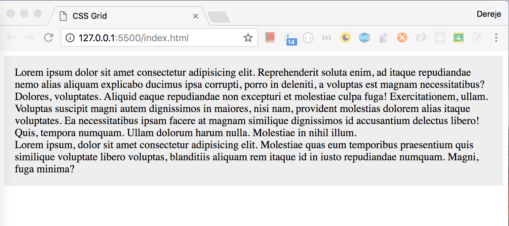
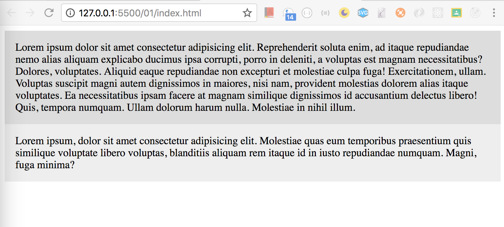
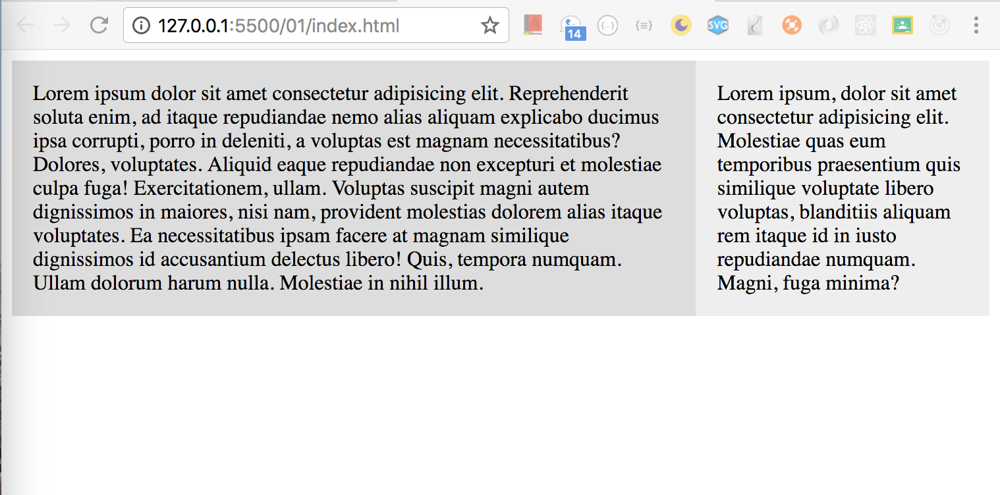
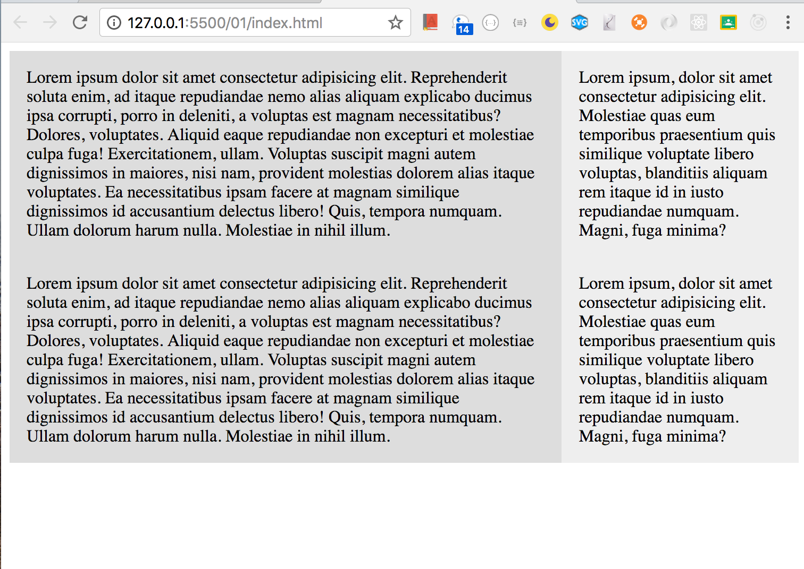
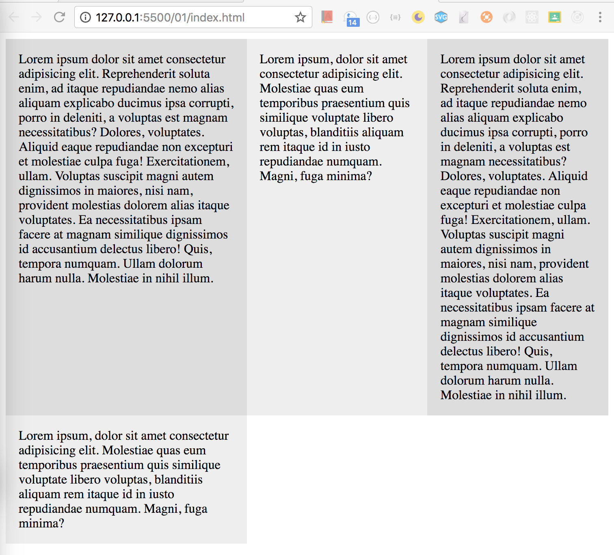
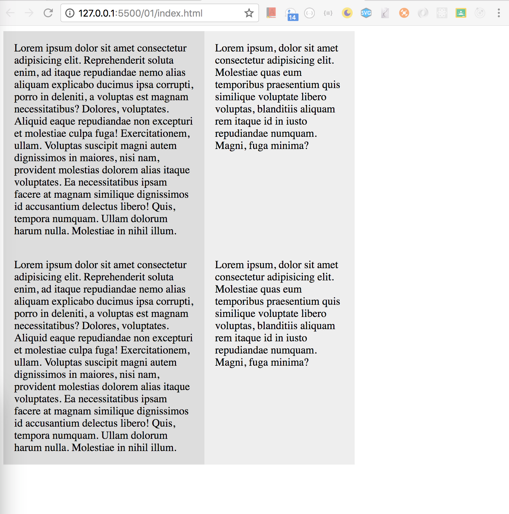
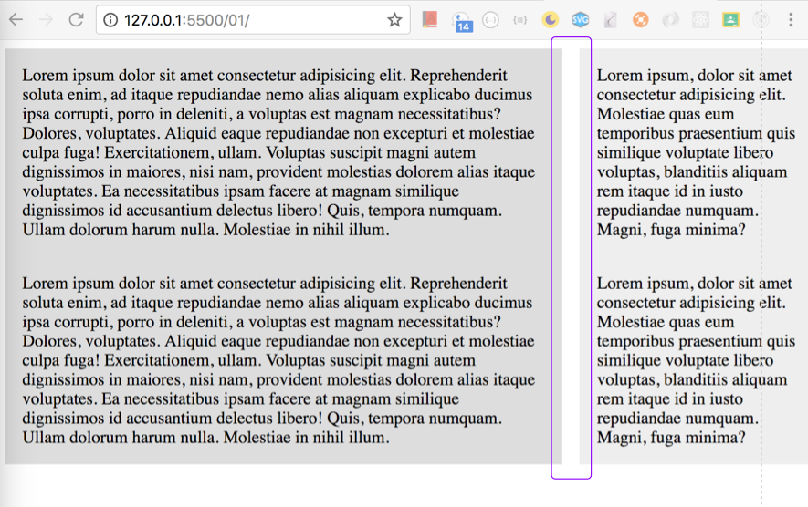

### Give all wrapper class grey color

```css
.wrapper {
  background: #eee;
}
```



### Give all div tags inside wrapper 1em padding

```css
.wrapper > div {
  background: #eee;
  padding: 1em;
}
```

### Give every odd div tag background of light gray

```css
.wrapper > div:nth-child(odd) {
  background: #ddd;
}
```



### Start working with grid

```css
.wrapper {
  display: grid;
}
```

> This will not do any thing. We need to define the width of the columns. To do that:

### Divide the grid column into two

```css
.wrapper {
  display: grid;
  grid-template-columns: 70% 30%;
}
```



> Since it is grid no matter how many div tags it is going to fallow this grid template. Just to test let us duplicate our div
> 

### Divide the grid column into three

```css
.wrapper {
  display: grid;
  grid-template-columns: 40% 30% 30%;
}
```



### What will hapen if

```css
.wrapper {
  display: grid;
  grid-template-columns: 40% 30%;
}
```



> For now let us change it to

```css
.wrapper {
  display: grid;
  grid-template-columns: 70% 30%;
}
```

### Give padding or spaces between columns

```css
.wrapper {
  display: grid;
  grid-template-columns: 70% 30%;
  grid-column-gap: 1em;
}
```


