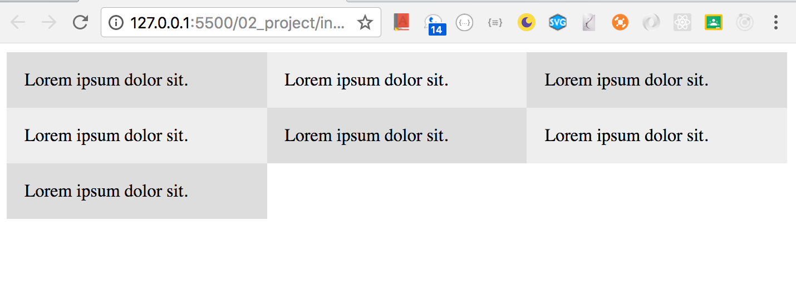
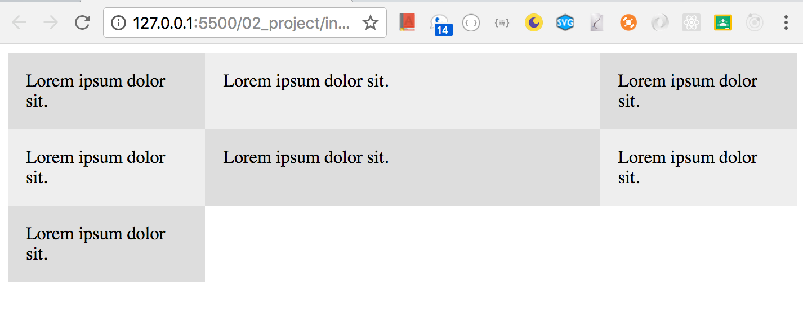
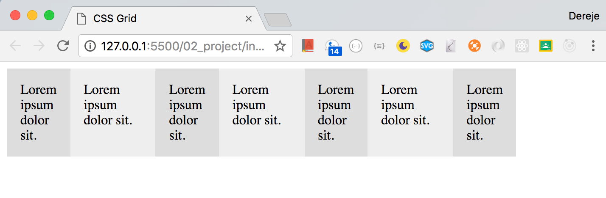
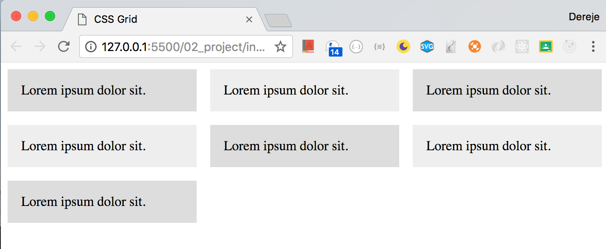
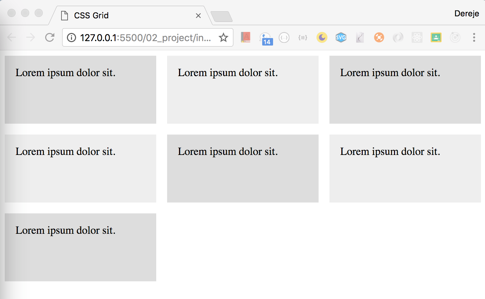
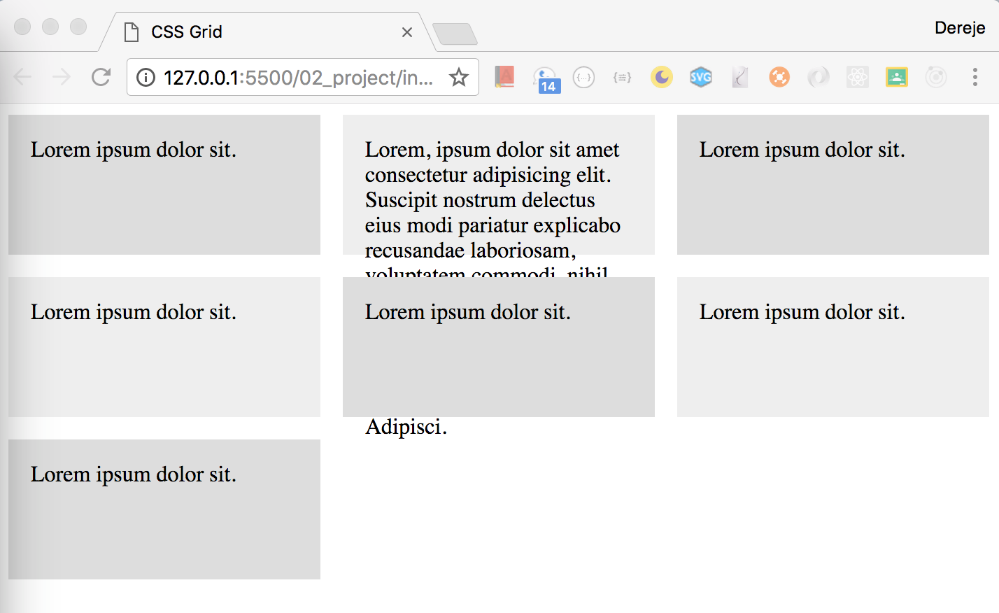
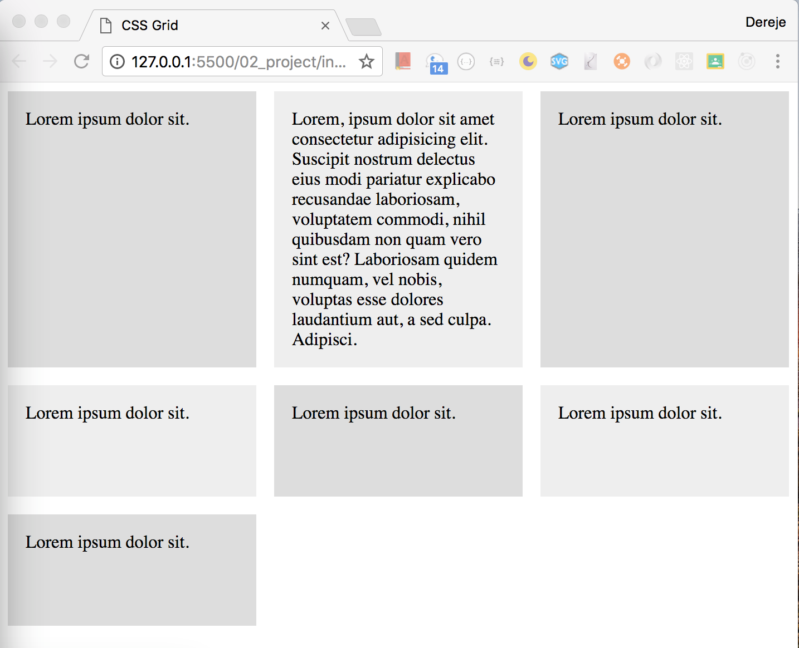
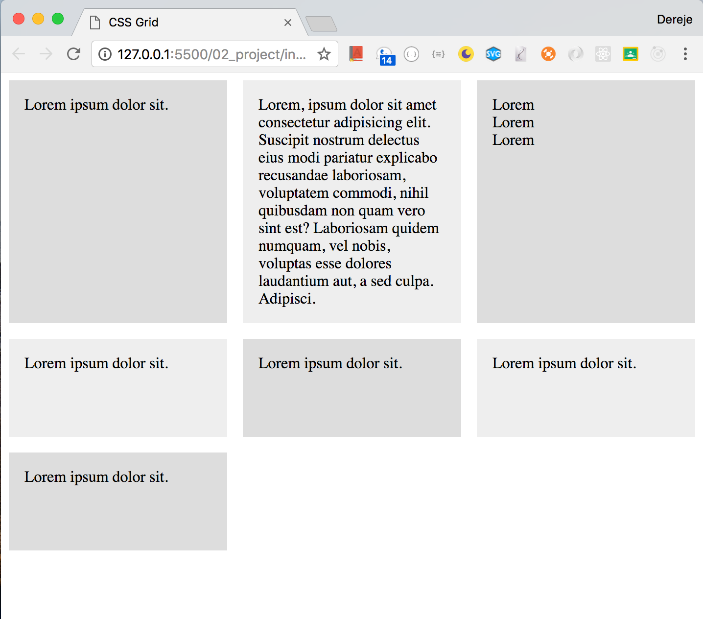

### Add seven dive tags in the index
```html
<!DOCTYPE html>
<html lang="en">
<head>
    <title>CSS Grid</title>
    <link rel="stylesheet" type="text/css" href="./style/style.css">
</head>
<body>
   <div class="wrapper">
       <div>Lorem ipsum dolor sit.</div>
       <div>Lorem ipsum dolor sit.</div>
       <div>Lorem ipsum dolor sit.</div>
       <div>Lorem ipsum dolor sit.</div>
       <div>Lorem ipsum dolor sit.</div>
       <div>Lorem ipsum dolor sit.</div>
       <div>Lorem ipsum dolor sit.</div>
       </div>
</body>
</html>
```
```css
.wrapper >div{
    background: #eee;
    padding: 1em;
}
.wrapper >div:nth-child(odd){
    background: #ddd;
}
```

### Add grid system
```css
.wrapper{
  display: grid;
}
```
### split the grid into three columns
```css
.wrapper{
  display: grid;
    grid-template-columns: 1fr 1fr 1fr 
}
```


### what would happen if:
```css
.wrapper{
  display: grid;
    grid-template-columns: 1fr 2fr 1fr 
}
```

> It is recommended to use fr over % or px (other usits). Because when you using % you will have an issue when you use padding and margin

### Other ways of writing `grid-template-columns: 1fr 2fr 1fr ` is
```css
.wrapper{
    display: grid;
    grid-template-columns: repeat(3 , 1fr) 
}
```

### What if I want 1f then 2fr to repeat?
```css
.wrapper{
    display: grid;
    grid-template-columns: repeat(4 , 1fr 2fr) 
}
```

### Add grid gap for the columns
```css
.wrapper{
    display: grid;
    grid-template-columns: repeat(3 , 1fr);
    grid-gap: 1em
}
```

### How do we give grid height
```css
.wrapper{
    display: grid;
    grid-template-columns: repeat(3 , 1fr);
    grid-gap: 1em;
    grid-auto-rows: 100px;
}
```

### What will happen if content of div overflow?

### To fix the overflow use min 100px and max height auto
```css
.wrapper{
    display: grid;
    grid-template-columns: repeat(3 , 1fr);
    grid-gap: 1em;
    grid-auto-rows: minmax(100px, auto);
}
```
> The height of the row will be defined by the max height of the row.

## Nested grid
```Html
<!DOCTYPE html>
<html lang="en">
<head>
    <title>CSS Grid</title>
    <link rel="stylesheet" type="text/css" href="./style/style.css">
</head>
<body>
   <div class="wrapper">
       <div>Lorem ipsum dolor sit.</div>
       <div>Lorem, ipsum dolor sit amet consectetur adipisicing elit. Suscipit nostrum delectus eius modi pariatur explicabo recusandae laboriosam, voluptatem commodi, nihil quibusdam non quam vero sint est? Laboriosam quidem numquam, vel nobis, voluptas esse dolores laudantium aut, a sed culpa. Adipisci.</div>
       <div class="nested">
           <div>Lorem</div>
           <div>Lorem</div>
           <div>Lorem</div>
       </div>
       <div>Lorem ipsum dolor sit.</div>
       <div>Lorem ipsum dolor sit.</div>
       <div>Lorem ipsum dolor sit.</div>
       <div>Lorem ipsum dolor sit.</div>
       </div>
</body>
</html>
```


### make the nested class a grid. How?
