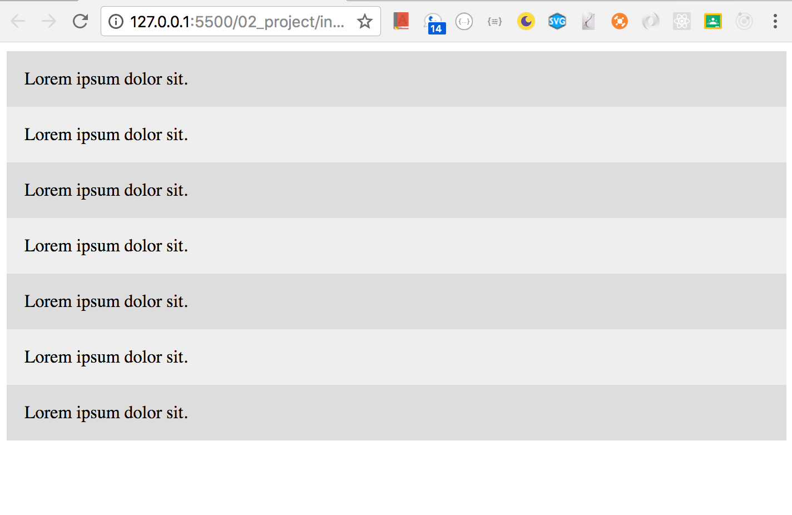

### Add seven dive tags in the index
```html
<!DOCTYPE html>
<html lang="en">
<head>
    <title>CSS Grid</title>
    <link rel="stylesheet" type="text/css" href="./style/style.css">
</head>
<body>
   <div class="wrapper">
       <div>Lorem ipsum dolor sit.</div>
       <div>Lorem ipsum dolor sit.</div>
       <div>Lorem ipsum dolor sit.</div>
       <div>Lorem ipsum dolor sit.</div>
       <div>Lorem ipsum dolor sit.</div>
       <div>Lorem ipsum dolor sit.</div>
       <div>Lorem ipsum dolor sit.</div>
       </div>
</body>
</html>
```
```css
.wrapper >div{
    background: #eee;
    padding: 1em;
}
.wrapper >div:nth-child(odd){
    background: #ddd;
}
```

