### Add seven dive tags in the index
```html
<!DOCTYPE html>
<html lang="en">
<head>
    <title>CSS Grid</title>
    <link rel="stylesheet" type="text/css" href="./style/style.css">
</head>
<body>
    <div class="wrapper">
<div class="box box1">Box 1</div>
<div class="box box2">Box 2</div>
<div class="box box3">Box 3</div>
<div class="box box4">Box 4</div>
    </div>
</body>
</html>
```
```css
.wrapper{
    display: grid;
}

.wrapper >div{
    background: #eee;
    padding: 1em;
}
.wrapper >div:nth-child(odd){
    background: #ddd;
}
```
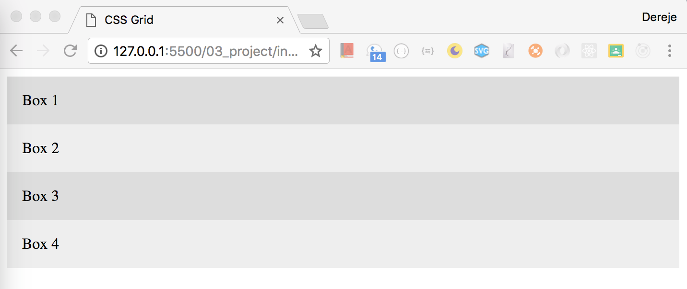
### Create 3 columns with 1fr 2fr and 1fr
```css
.wrapper{
    display: grid;
    grid-template-columns: 1fr 2fr 1fr;
}
```
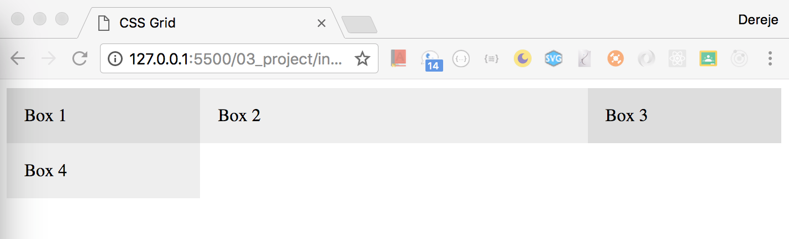
### Add auto rows
```css
.wrapper{
    display: grid;
    grid-template-columns: 1fr 2fr 1fr;
    grid-auto-rows: minmax(100px, auto);
}
```
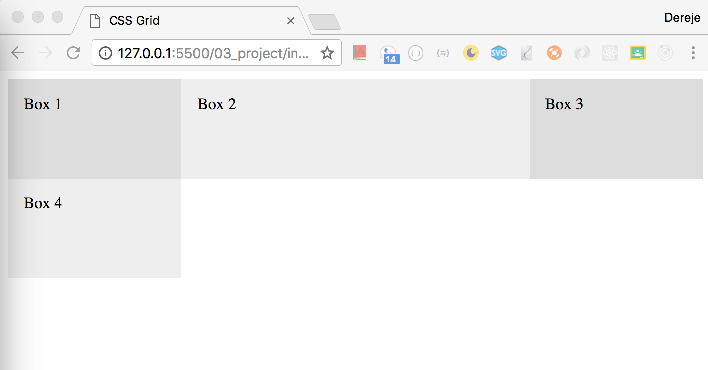
### Add grid gap
```css
.wrapper{
    display: grid;
    grid-template-columns: 1fr 2fr 1fr;
    grid-auto-rows: minmax(100px, auto);
    grid-gap: 1em;
}
```
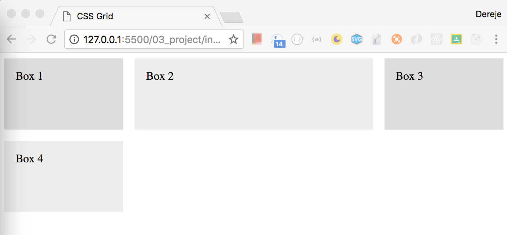
### Align all item to their start point
```css
.wrapper{
    display: grid;
    grid-template-columns: 1fr 2fr 1fr;
    grid-auto-rows: minmax(100px, auto);
    grid-gap: 1em;
    justify-items: start;
}
```
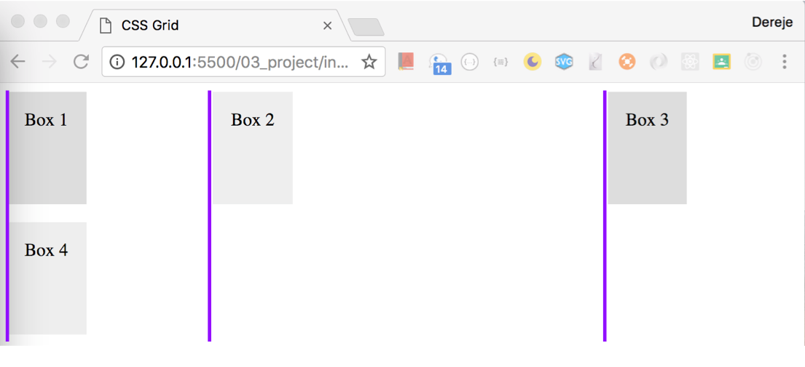
### Justify all item to their start point
```css
.wrapper{
    display: grid;
    grid-template-columns: 1fr 2fr 1fr;
    grid-auto-rows: minmax(100px, auto);
    grid-gap: 1em;
    justify-items: center;
}
```
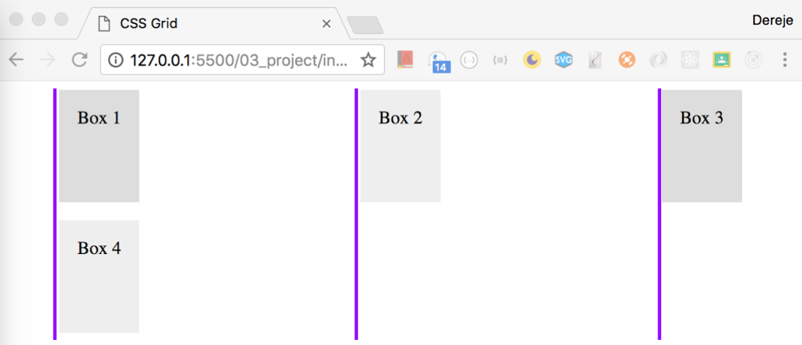
> compare it with out justify-item


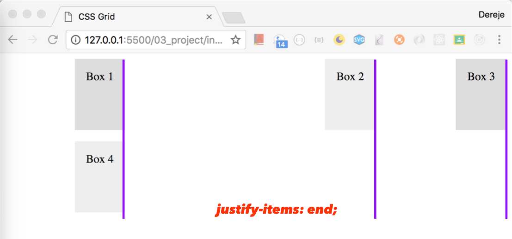
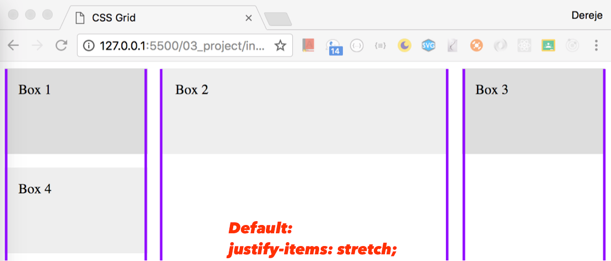
### Align all item to their start point
```css
.wrapper{
    display: grid;
    grid-template-columns: 1fr 2fr 1fr;
    grid-auto-rows: minmax(100px, auto);
    grid-gap: 1em;
    justify-items: stretch;
    align-items: stretch;
}
```
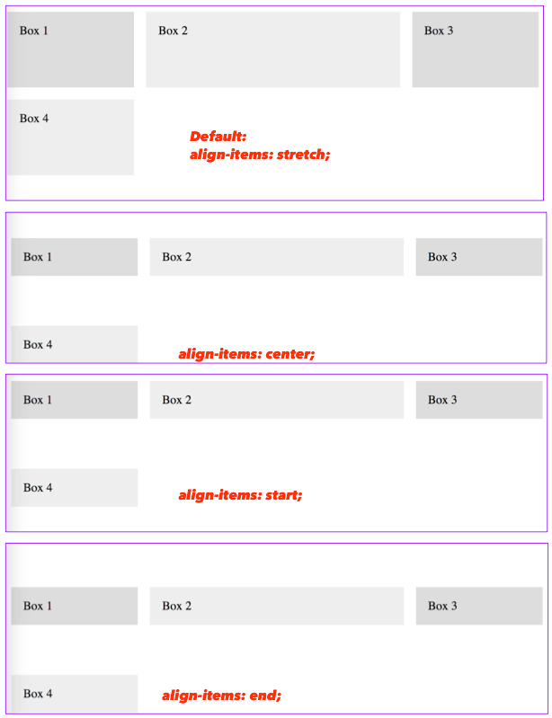
### Align individual item to their start point using `align-self`
```css
.box1{
    align-self: center;
}
.box2{
    align-self: start;
}
.box4{
    align-self: end;
}
```
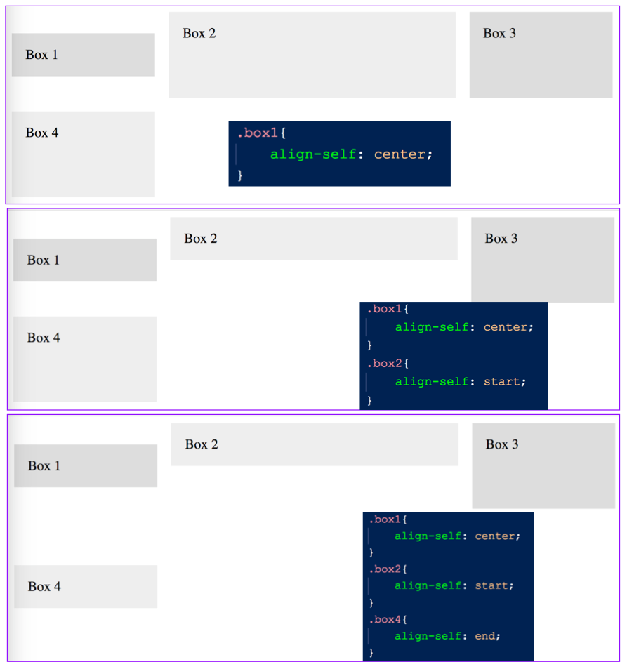

###

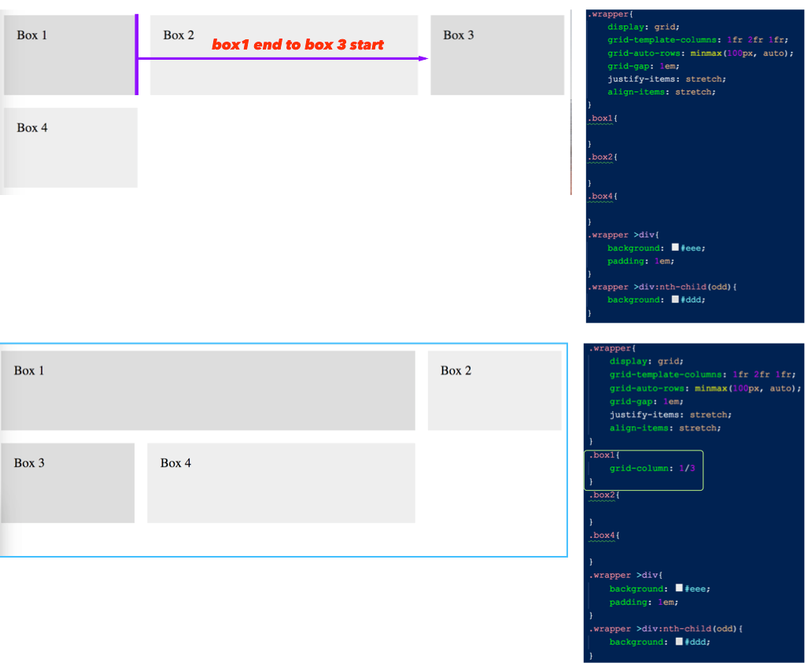
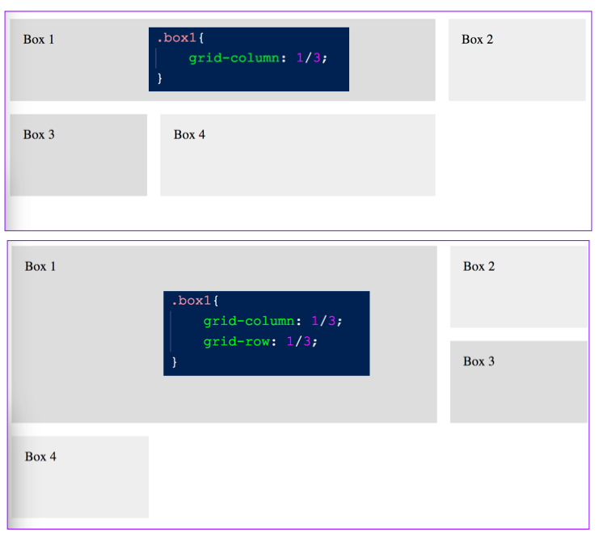
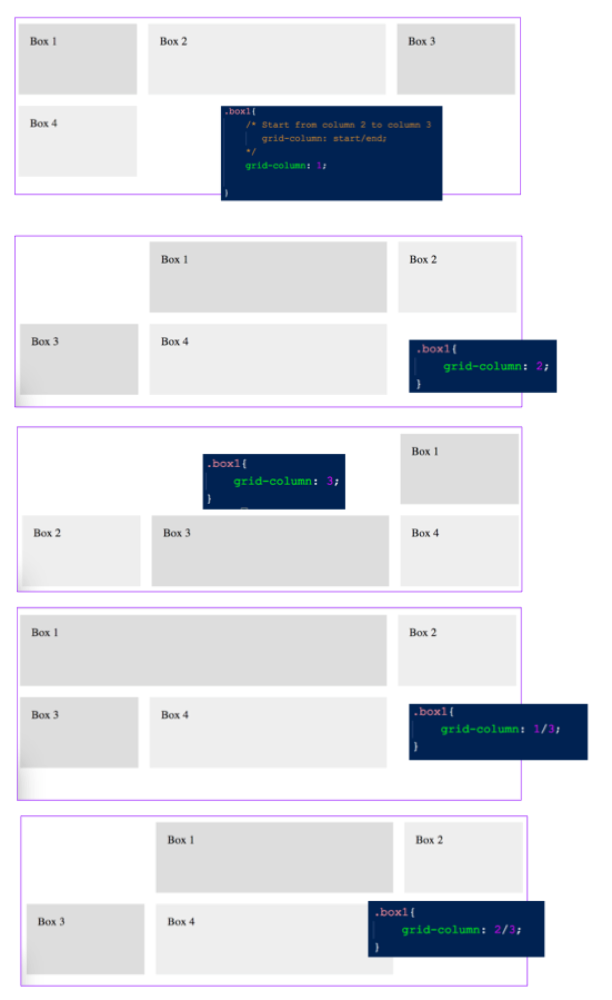